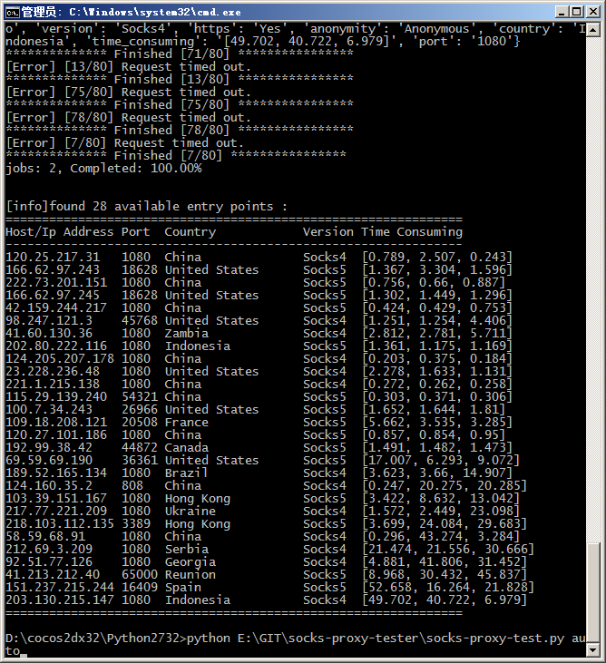

# socks-proxy-tester  [](https://travis-ci.org/DD-L/socks-proxy-tester)

[](https://gitter.im/DD-L/socks-proxy-tester?utm_source=badge&utm_medium=badge&utm_campaign=pr-badge&utm_content=badge)

SOCKS v4/v5 Proxy Tester

###Requirements:
* Python 2.7.x
* PySocks         (pip install PySocks)
* requests        (pip install requests)
* requesocks      (pip install requesocks)

###Usage:
```shell
    ./socks-proxy-test.py auto [<max-jobs>]
    ./socks-proxy-test.py <host> <port> <socks-version>
    ./socks-proxy-test.py <option>
```

###Examples:
```shell
$ # Automatically get socks proxy entries from http://socks-proxy.net/
$ # and, Identify the available entries with default 40 jobs.
$ ./socks-proxy-test.py auto

$ # Automatically get socks proxy entries from http://socks-proxy.net/
$ # and, Identify the available entries with 38 jobs.
$ ./socks-proxy-test.py auto 38

$ # Verify if socks4://127.0.0.1:1080 is available.
$ ./socks-proxy-test.py 127.0.0.1 1080 4

$ # Verify if socks5://127.0.0.1:1080 is available.
$ ./socks-proxy-test.py 127.0.0.1 1080 5

$ # Verify if socks5://socks5-proxy.examples.com is available.
$ ./socks-proxy-test.py socks5-proxy.examples.com 1080 5
```

###Screenshot:

Tips: 'time-consuming' is in seconds

* auto mode




* normal mode


###License

[MIT](./LICENSE)
